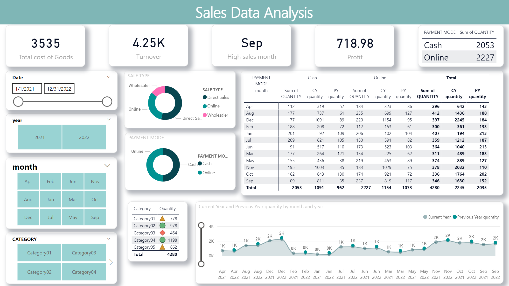

# 📊 Generic Sales Analysis Dashboard

[](https://opensource.org/licenses/MIT)
[](https://powerbi.microsoft.com/)
[](Dataset/Sales%20data.xlsx)
[]()
[]()
[](https://github.com/pouryare)

A comprehensive Power BI dashboard analyzing sales patterns and performance metrics. This interactive visualization tool provides insights into sales trends, category distribution, and payment methods across different time periods.



## 📋 Table of Contents
- [Overview](#overview)
- [Key Features](#key-features)
- [Dashboard Components](#dashboard-components)
- [Dataset Description](#dataset-description)
- [Technical Implementation](#technical-implementation)
- [Installation](#installation)
- [File Structure](#file-structure)
- [Key Insights](#key-insights)
- [License](#license)

## 🎯 Overview

The Generic Sales Analysis Dashboard transforms complex sales data into actionable insights through detailed visualization of sales patterns, product categories, payment methods, and temporal distribution. It enables data-driven decision-making for business strategy and sales optimization.

## ✨ Key Features

- 📈 Sales Trend Analysis
- 🏷️ Category Performance Metrics
- 💳 Payment Mode Distribution
- 📅 Monthly Sales Patterns
- 💰 Revenue and Profit Tracking
- 🔄 Year-over-Year Comparison
- 🏪 Sales Channel Analysis

## 📊 Dashboard Components

### 1. Key Metrics Cards
- Total Cost of Goods (3,535)
- Turnover (4.25K)
- High Sales Month (Sep)
- Profit (718.98)
- Payment Mode Distribution
  - Cash: 2,053 units
  - Online: 2,227 units

### 2. Distribution Analysis
- Sales type breakdown (Wholesaler, Direct Sales, Online)
- Payment mode distribution
- Category-wise sales distribution
- Monthly sales patterns

### 3. Category Analysis
- Category01 (778 units)
- Category02 (978 units)
- Category03 (464 units)
- Category04 (1,198 units)
- Category05 (862 units)

### 4. Temporal Analysis
- Monthly trends visualization
- Year-over-Year comparison
- High sales month identification (September: 1,630 units)
- Seasonal patterns analysis

## 📚 Dataset Description

The dataset includes comprehensive sales records with the following key variables:

### Key Features
- 📅 Date and Time
- 💰 Sales Amount
- 🏷️ Product Categories
- 💳 Payment Methods
- 🏪 Sales Channels
- 📊 Quantity Data

### Dataset Structure
- Sales data.xlsx (Main dataset)
  - Transaction details
  - Category information
  - Payment data
  - Sales channel information
  - Quantity metrics

## 🔧 Technical Implementation

### Data Model Features
1. Clean and Transformed Data
2. Custom Calculated Measures
3. Dynamic Visualizations
4. Interactive Filters
5. Cross-filtering Capabilities

### Key Metrics Tracking
- Year-over-Year Calculations
- Category Performance Analysis
- Payment Method Distribution
- Sales Channel Performance

## 📥 Installation

```bash
# Clone this repository
git clone https://github.com/pouryare/Generic-Sales-Analysis.git
cd Generic-Sales-Analysis

# Open the .pbix file
# Connect to your data source
# Refresh the dashboard
```

## 📁 File Structure

```
📦 Generic-Sales-Analysis
 ┣ 📂 Dataset
 ┃ ┗ 📄 Sales data.xlsx
 ┣ 📜 .gitattributes
 ┣ 📜 Generic sales data analysis.pbix
 ┣ 📜 LICENSE
 ┣ 📜 README.md
 ┗ 📷 screenshot.png
```

## 🔍 Key Insights

1. **Overall Performance**
   - Total sales volume: 4,280 units
   - Highest sales month: September (1,630 units)
   - Balanced payment distribution between cash (2,053) and online (2,227) methods

2. **Category Performance**
   - Category04 leads with 1,198 units
   - Category02 follows with 978 units
   - Category05 shows strong performance with 862 units
   - Category01 maintains steady sales with 778 units
   - Category03 records 464 units

3. **Channel Analysis**
   - Mixed distribution across wholesalers, direct sales, and online channels
   - Online payments slightly outperform cash transactions
   - Clear seasonal patterns visible in monthly trends

4. **Temporal Patterns**
   - September stands out as peak sales month
   - Year-over-Year comparisons show varying growth patterns
   - Monthly trends indicate seasonal influences
   - Clear patterns in payment method preferences over time

## 📄 License

This project is licensed under the MIT License - see the [LICENSE](LICENSE) file for details.

Made with ❤️ by [Pourya](https://github.com/pouryare)

[](https://github.com/pouryare)